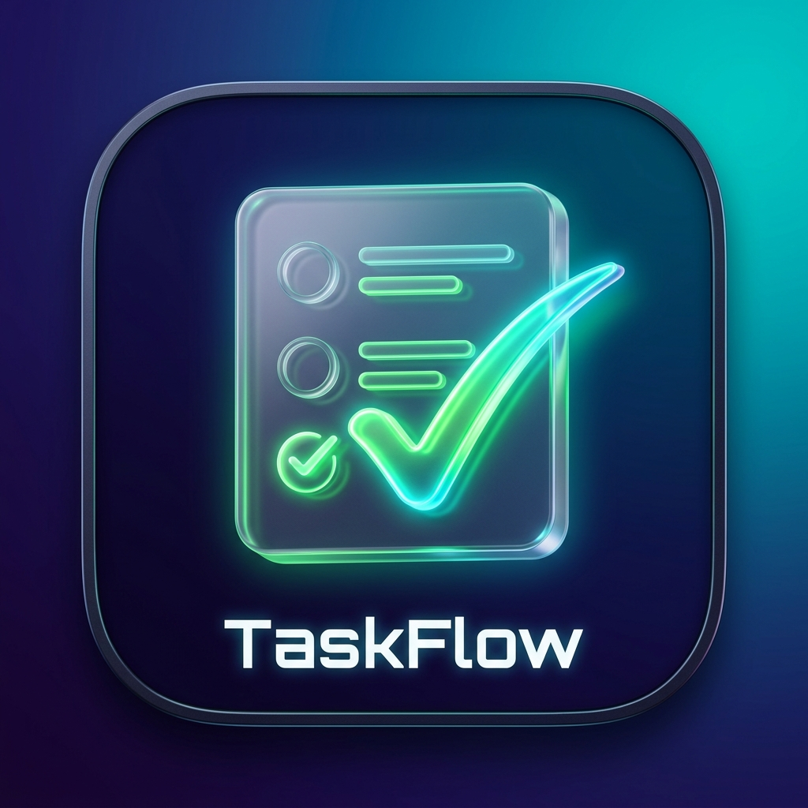

<div align="center">

  

  # TaskFlow

  **A Modern, Elegant & Feature-Rich Task Manager Application built with Flutter & Dart.**

  [](https://github.com/ITSPRANAV16/TaskFlow/releases)
  [](https://flutter.dev)
  [](https://dart.dev)
  [](https://github.com/ITSPRANAV16/TaskFlow)
  [](LICENSE)

  <br />

  [**Explore Releases**](https://github.com/ITSPRANAV16/TaskFlow/releases) • [**Report Bug**](https://github.com/ITSPRANAV16/TaskFlow/issues) • [**Request Feature**](https://github.com/ITSPRANAV16/TaskFlow/issues)

</div>

---

## 📖 Table of Contents

- [Features](#-features)
- [Screenshots](#-screenshots)
- [Download & Installation](#-download--installation)
- [How to Build](#-how-to-build)
- [Tech Stack & Architecture](#-tech-stack--architecture)
- [Developer Information](#-developer-information)
- [License](#-license)

---

## ✨ Features

- ⚡ **Offline-First & High Performance**: Powered by fast local persistence (`SharedPreferences`), ensuring your data is instant, private, and always available offline.
- 🎨 **Modern Glassmorphic UI**: Premium aesthetic design with smooth HSL Indigo/Teal gradients, fluid micro-animations, and clean cards.
- 📋 **Nested Subtasks & Checklists**: Break down complex projects into subtask items with live completion progress indicators.
- 🚦 **Color-Coded Priority Levels**: Organize your tasks by urgency (**Urgent 🟣, High 🔴, Medium 🟡, Low 🟢**).
- 🏷️ **Smart Categorization**: Group tasks seamlessly (*Work, Personal, Study, Health, Shopping, Finance, Other*).
- 📊 **Productivity Analytics & Dashboard**: Daily progress progress bar, completed vs pending counters, and urgent alert badges.
- 🔄 **In-App Auto Update System**: Seamlessly checks [GitHub Releases](https://github.com/ITSPRANAV16/TaskFlow/releases) on startup and prompts one-tap downloads for new versions.
- 📱 **Cross-Platform Responsive Layout**: Dynamically adapts layout for Android mobile view and Windows Desktop multi-pane sidebar grids.
- 🌙 **Dark & Light Mode Support**: Powered by Google Fonts (*Outfit & Inter*) with automatic system theme synchronization.

---

## 📱 Screenshots

<div align="center">

| 📊 **Dashboard & Overview** | 📋 **Task List & Subtasks** | 🌙 **Dark Mode & Priority** |
| :---: | :---: | :---: |
|  |  |  |

| 🏷️ **Categories & Search** | ⚙️ **Create & Edit Task** | 👤 **About & Auto Update** |
| :---: | :---: | :---: |
|  |  |  |

</div>

---

## 📥 Download & Installation

| Platform | Download Link | Build Type | Status |
| :--- | :--- | :--- | :--- |
| 📱 **Android** | [Download APK](https://github.com/ITSPRANAV16/TaskFlow/releases/latest) | `.apk` (ARM64) | ✅ Stable Release |
| 🍎 **iOS / Apple** | [Download IPA](https://github.com/ITSPRANAV16/TaskFlow/releases/latest) | `.ipa` / TestFlight | 🔜 Coming Soon (Next Update) |
| 💻 **Windows** | [Download Executable](https://github.com/ITSPRANAV16/TaskFlow/releases/latest) | `.exe` / Portable | 🔜 Coming Soon (Next Update) |
| 🌐 **Web** | [Open Web App](https://github.com/ITSPRANAV16/TaskFlow/releases/latest) | HTML / JS | 🔜 Coming Soon (Next Update) |

---

## 🛠️ How to Build

Follow these steps to set up and build **TaskFlow** locally on your computer:

### 1. Clone the Repository
```bash
git clone https://github.com/ITSPRANAV16/TaskFlow.git
cd TaskFlow
```

### 2. Install Dependencies
```bash
flutter pub get
```

### 3. Run the Application
- **Chrome Web Browser**:
  ```bash
  flutter run -d chrome
  ```
- **Windows Desktop**:
  ```bash
  flutter run -d windows
  ```
- **Android Device**:
  ```bash
  flutter run
  ```

### 4. Build Production Binaries
- **Android APK**:
  ```bash
  flutter build apk --debug --target-platform android-arm64
  ```
- **Windows Desktop**:
  ```bash
  flutter build windows
  ```
- **Web Production**:
  ```bash
  flutter build web
  ```

---

## 🏗️ Tech Stack & Architecture

- **UI Framework**: [Flutter SDK](https://flutter.dev) (v3.41.3)
- **Language**: [Dart](https://dart.dev) (v3.11.1)
- **State Management**: [Provider](https://pub.dev/packages/provider) (`ChangeNotifier` Pattern)
- **Data Persistence**: [SharedPreferences](https://pub.dev/packages/shared_preferences)
- **Typography & Fonts**: [Google Fonts](https://pub.dev/packages/google_fonts) (*Outfit & Inter*)
- **Icons & Assets**: Custom 3D Glassmorphic Icon & [flutter_launcher_icons](https://pub.dev/packages/flutter_launcher_icons)
- **HTTP & Auto Update**: [http](https://pub.dev/packages/http) & GitHub Releases REST API Integration
- **Deep Linking**: [url_launcher](https://pub.dev/packages/url_launcher)

---

## 👨‍💻 Developer Information

<div align="center">

  ### **Pranav Patil**
  *Android Developer & Cross-Platform Software Engineer*

  [](https://github.com/ITSPRANAV16)
  [](https://www.instagram.com/pranav_patil__16?igsh=Ym0wY2s3ZGx1M244)

</div>

---

## 📄 License

This project is licensed under the MIT License - see the [LICENSE](LICENSE) file for details.

<div align="center">
  <sub>Built with ❤️ by Pranav Patil</sub>
</div>
